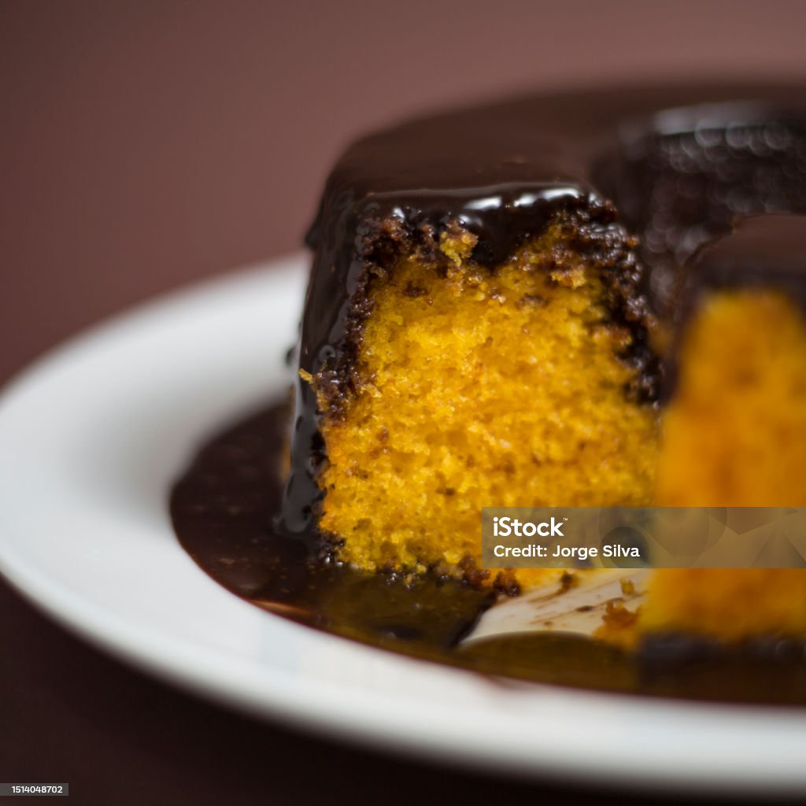
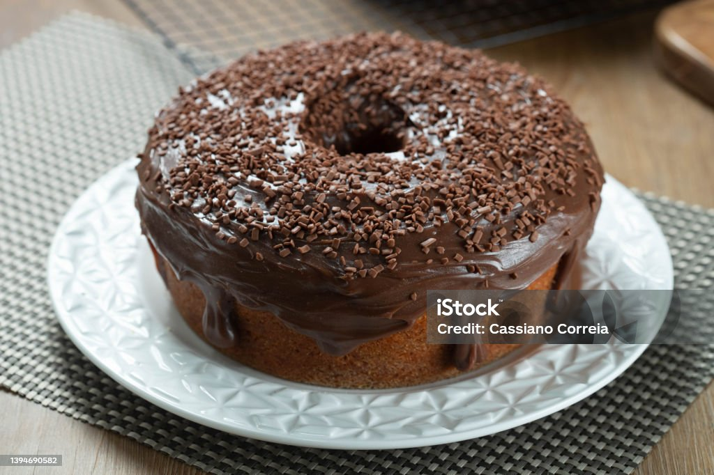

# SoulCode Exercise 🎓

Este repositório contém o meu primeiro exercício da aula da **SoulCode**. 🌟

## Sobre o Bootcamp

🎉 Iniciei o Bootcamp com a SoulCode! As aulas são ao vivo e têm como objetivo capacitar os alunos a se tornarem Desenvolvedores Full Stack em **React** e **Node.js**. 

## Primeiro Exercício 🚀

O exercício consiste em uma página HTML que exibe uma receita, é claro que escolhi o meu bolo preferido! 🍰

## Descrição do Projeto 📋

A página criada inclui:

- **Título da Receita:** Nome da receita no cabeçalho. 📝
- **Imagem do Bolo:** Uma imagem ilustrativa do bolo. 🍰
- **Descrição:** Uma breve descrição sobre a receita e o autor. 📖
- **Ingredientes:** Lista de ingredientes necessários. 🛒
- **Informações Nutricionais:** Detalhes nutricionais em uma tabela. 📊
- **Modo de Preparo:** Passos detalhados para preparar a receita. 🥄
- **Detalhes da Receita:** Informações sobre o tempo de preparo, rendimento e dificuldade. ⏱️
- **Links para Redes Sociais:** Links para Instagram e LinkedIn. 🔗

## Tecnologias Utilizadas 💻

- 
- 
- 
- 
- 

## Como Visualizar o Projeto

1. Clone o repositório para sua máquina local:

    ```bash
    git clone https://github.com/Zirlanefiuza/soulcode-exercise.git
    ```

2. Navegue até o diretório do projeto:

    ```bash
    cd SoulCode/exercicio 
    ```

3. Abra o arquivo `receita.html` em um navegador web.

## Capturas de Tela 📸

### Página Inicial




### Ingredientes



## Contato 📬

Para mais informações, entre em contato:

- [Instagram](https://www.instagram.com/zilanefiuza) 📷
- [LinkedIn](https://www.linkedin.com/in/zirlane-fiuza) 💼

## Animações ✨

Aqui estão algumas animações simples para tornar a página mais dinâmica e interessante:

```css
/* Adicione isso ao seu arquivo CSS */
@keyframes fadeIn {
    from {
        opacity: 0;
    }
    to {
        opacity: 1;
    }
}

.fade-in {
    animation: fadeIn 2s ease-in;
}
